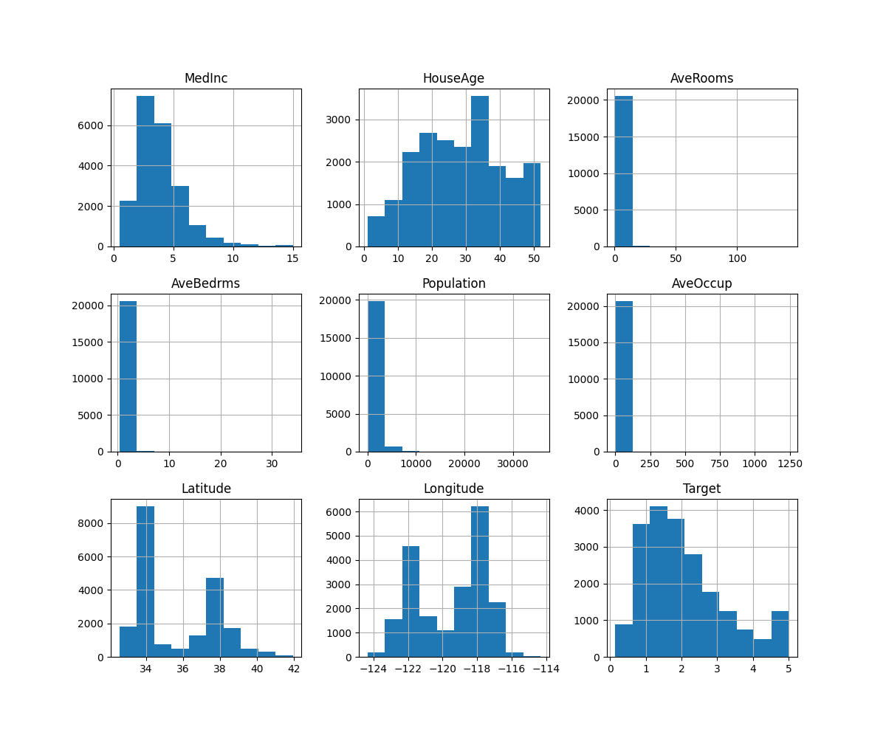
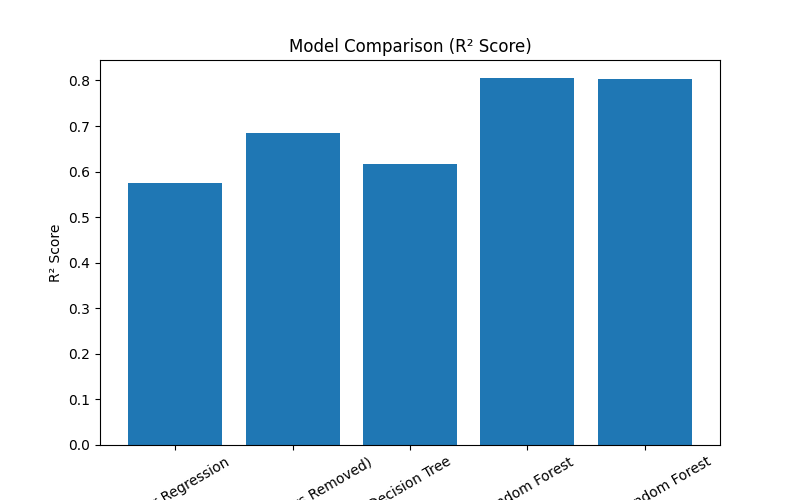
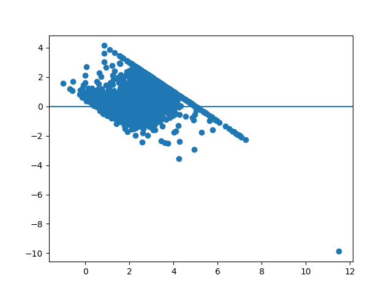
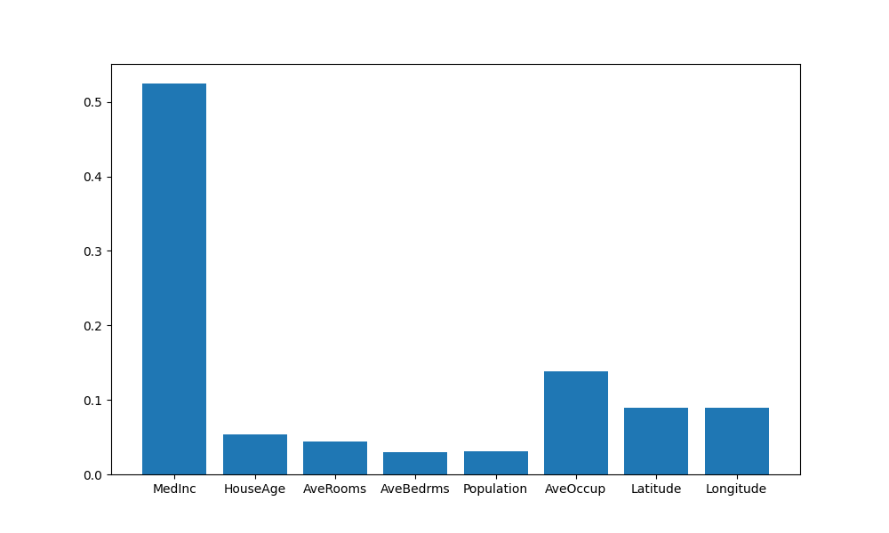
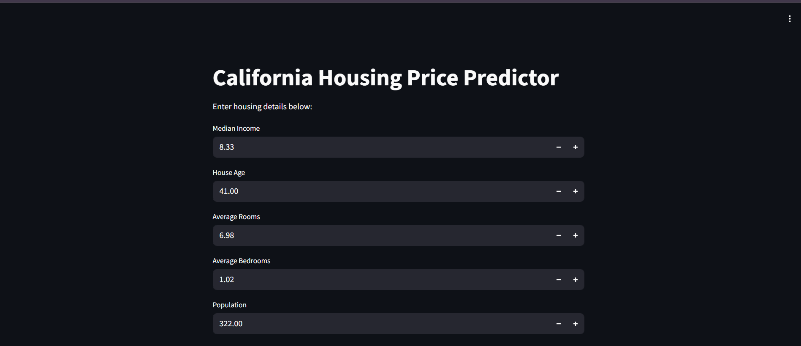
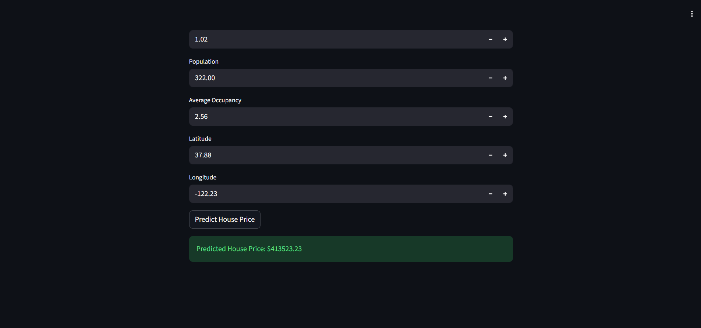

# California Housing Price Prediction using Machine Learning

## Results Summary

* Best Model: Random Forest Regressor
* Best R² Score: 0.8038
* Cross Validation: 5-Fold Cross Validation
* Deployment: Streamlit Web Application
* Primary Focus: Regression Modeling, Preprocessing, Model Evaluation, Residual Analysis

---

# Project Overview

This project focuses on predicting California housing prices using multiple Machine Learning regression models and evaluating their performance using statistical metrics and validation techniques.

The project was designed as a complete end-to-end regression workflow covering:

* Exploratory Data Analysis (EDA)
* Data preprocessing
* Outlier detection and handling
* Model training and comparison
* Cross-validation
* Residual analysis
* Hyperparameter tuning
* Feature importance analysis
* Streamlit deployment

The goal was not only to build accurate models, but also to understand model behavior, generalization capability, preprocessing impact, and regression diagnostics.

---

# Dataset Information

The project uses the California Housing dataset from `sklearn.datasets`.

## Features Used

* Median Income (`MedInc`)
* House Age (`HouseAge`)
* Average Rooms (`AveRooms`)
* Average Bedrooms (`AveBedrms`)
* Population
* Average Occupancy (`AveOccup`)
* Latitude
* Longitude

## Target Variable

* Median House Value

---

# Machine Learning Workflow

## 1. Exploratory Data Analysis (EDA)

Performed detailed EDA to:

* Understand feature distributions
* Detect skewness
* Analyze correlations
* Identify outliers
* Study geographical feature patterns

### Feature Distribution Analysis



Feature distributions revealed skewness and extreme observations in several variables, motivating additional preprocessing experiments.

---

# 2. Data Preprocessing

## Train-Test Split

* 80% Training Data
* 20% Testing Data

## Outlier Detection

Used the **IQR (Interquartile Range)** method on:

* AveRooms
* AveBedrms
* AveOccup

The experiment demonstrated how selective preprocessing improves Linear Regression performance.

---

# 3. Models Implemented

## Linear Regression

Used as a baseline regression model.

## Decision Tree Regressor

Used to capture non-linear feature relationships.

## Random Forest Regressor

Used ensemble learning to improve generalization and reduce overfitting.

## Hyperparameter Tuning

Applied `RandomizedSearchCV` to optimize Random Forest parameters.

---

# Model Performance

| Model                                | R² Score | Observation                                 |
| ------------------------------------ | -------- | ------------------------------------------- |
| Linear Regression                    | 0.5758   | Baseline performance                        |
| Linear Regression (Outliers Removed) | 0.6844   | Significant improvement after preprocessing |
| Decision Tree Regressor              | 0.6250   | Overfitting observed                        |
| Random Forest Regressor              | 0.8038   | Best overall performance                    |
| Tuned Random Forest                  | 0.8013   | Similar performance after tuning            |

---

# Model Comparison Visualization



Random Forest achieved the strongest predictive performance while maintaining better generalization capability than Decision Tree.

---

# Residual Analysis

Residual analysis was performed to evaluate regression assumptions and prediction error behavior.

Key observations:

* Non-random residual patterns
* Heteroscedasticity
* Underestimation of high target values
* Increasing error spread in certain prediction ranges

These findings highlighted the limitations of Linear Regression on complex relationships.



Residual plots showed that Linear Regression could not fully capture the non-linear structure of the dataset.

---

# Feature Importance Analysis

Feature importance analysis using Random Forest revealed:

* Median Income was the strongest predictor
* Geographical features had major influence
* Population-related features contributed less



Feature importance analysis demonstrated that income and geographical location strongly influence housing prices.

---

# Cross Validation

Used 5-Fold Cross Validation to evaluate model stability and generalization performance.

This helped compare:

* Single train-test split performance
* Fold-wise consistency
* Realistic generalization capability

Cross-validation scores showed that some single-split evaluations were slightly optimistic, highlighting the importance of robust validation techniques.

---

# Streamlit Web Application

A Streamlit application was created for interactive house price prediction.

Users can:

* Enter housing feature values
* Generate real-time predictions
* Interact with the trained Random Forest model

## Streamlit UI



Interactive interface for entering housing features.

---

## Prediction Example



Example prediction generated using the deployed model.

---

# Technologies Used

* Python
* Pandas
* NumPy
* Matplotlib
* Scikit-learn
* Streamlit
* Joblib

---

# Project Structure

```bash
california-housing-ml/
│
├── app.py
├── images/
├── notebooks/
│   └── housing_price_prediction.ipynb
├── README.md
├── requirements.txt
└── .gitignore
```

---

# Key Learnings

* End-to-end regression workflow implementation
* Exploratory Data Analysis techniques
* Outlier handling using IQR
* Regression model comparison
* Cross-validation for reliable evaluation
* Residual analysis and error diagnostics
* Ensemble learning using Random Forest
* Hyperparameter tuning with RandomizedSearchCV
* Impact of preprocessing on model performance
* Building and deploying ML applications with Streamlit

---

# Future Improvements

* Add feature scaling experiments
* Deploy permanently using Streamlit Cloud
* Add advanced regression models like XGBoost
* Implement model pipelines
* Add automated hyperparameter optimization

---

# Deployment Note

The Streamlit deployment link generated using LocalTunnel is temporary and may expire after the runtime session ends.

---

# Conclusion

This project demonstrates a complete Machine Learning regression pipeline from raw data analysis to deployment.

The experiments highlighted that:

* Preprocessing quality significantly impacts model performance
* Cross-validation provides more realistic evaluation
* Ensemble methods outperform simple regression models on complex datasets
* Residual analysis is critical for understanding model limitations

Random Forest Regressor achieved the best overall predictive performance with an R² Score above 0.80.

